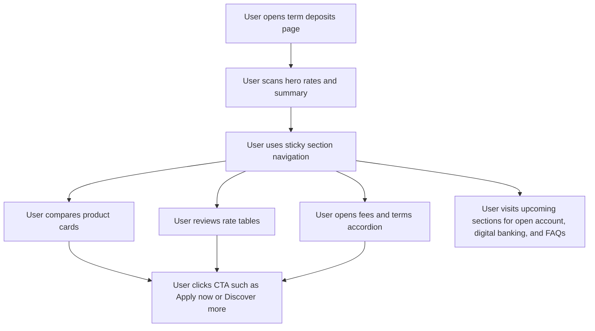

## 1. Product Overview
Build a responsive banking product page in Next.js that reproduces the provided term deposit screenshots as closely as possible while staying easy to extend.
- The page presents a premium term deposit experience for personal, joint, company, and trust account audiences, with screenshot-matched copy and layout.
- The initial release focuses on UI fidelity, mobile adaptability, and future readiness for additional sections, more images, and later Supabase integration.

## 2. Core Features

### 2.1 Feature Module
1. **Term deposits landing page**: global header, hero banner, sticky section navigation, product cards, rate tables, informational panels, accordion content, footer actions.
2. **Responsive navigation experience**: desktop nav layout, tablet adaptation, mobile menu or stacked navigation behavior.
3. **Expanded conversion and support framework**: completed `Open an account`, `Digital banking`, and `FAQs` sections with screenshot-matched layout, structured explanatory content, and support/footer content.

### 2.2 Page Details
| Page Name | Module Name | Feature description |
|-----------|-------------|---------------------|
| Term deposits page | Top utility navigation | Displays personal/business links, search/login affordances, and primary banking categories in a premium banking style |
| Term deposits page | Breadcrumb | Shows location context for the product page |
| Term deposits page | Hero banner | Uses the provided banking-style composition with a high-contrast rate summary panel and supporting imagery |
| Term deposits page | Sticky section navigation | Keeps `Products`, `Rates and fees`, `Open an account`, `Digital banking`, and `FAQs` visible with an `Apply now` CTA |
| Term deposits page | Product comparison | Shows the two term deposit offerings with iconography, benefit bullets, and action buttons |
| Term deposits page | Digital term deposit rates | Displays segmented deposit amount controls and rate table content for individual or joint accounts |
| Term deposits page | Existing customer info panel | Highlights contextual information in a soft blue callout block |
| Term deposits page | Classic term deposit rates | Displays the company or trust account offer with segmented controls and a wider rate table |
| Term deposits page | Accordion section | Supports fees, terms, and conditions content blocks with expand/collapse behavior |
| Term deposits page | Scroll-to-top affordance | Provides a floating action button similar to the reference UI |

## 3. Core Process
The user lands on the term deposits page, reviews headline rates and product differences, jumps to the desired section using the sticky navigation, inspects rates and information panels, and later will be able to review the `Open an account`, `Digital banking`, and `FAQs` content once that content is supplied.

## 4. User Interface Design
### 4.1 Design Style
- Primary colors: charcoal, black, white, soft gray backgrounds, and a vivid banking blue for active states and CTAs
- Button style: rectangular buttons with slight radius, bold labels, strong contrast, subtle hover transitions
- Font and sizes: elegant high-contrast display font for headings paired with a clean readable body font; generous headline scale and roomy section spacing
- Layout style: premium editorial banking layout with a fixed-width content container, sticky top navigation, card-based product comparison, and structured tabular sections
- Icon style suggestions: thin-stroke line icons for finance concepts, minimal arrow glyphs, restrained utility icons

### 4.2 Page Design Overview
| Page Name | Module Name | UI Elements |
|-----------|-------------|-------------|
| Term deposits page | Hero banner | Large background image, black overlay content panel, oversized heading, split featured rates, subtle shadowing |
| Term deposits page | Sticky section navigation | White elevated bar, active tab underline, right-aligned CTA, responsive collapse behavior |
| Term deposits page | Product comparison | Two bordered white cards, icon badge, optional `New` pill, bullet lists, paired action buttons |
| Term deposits page | Rate sections | Centered headings, segmented switch UI, minimalist data tables, supportive body copy, soft informational highlight boxes |
| Term deposits page | Accordion | Clean dividers, large trigger labels, smooth expand/collapse motion |
| Term deposits page | Open an account | Centered section title, account-type toggle, and structured guidance cards for individual/joint and company/trust applicants |
| Term deposits page | Digital banking | Promotional split layout with supporting image and benefit bullets |
| Term deposits page | FAQ section | Two-column layout with oversized heading and collapsible detailed answers |
| Term deposits page | Existing customer support | Three-card help area for app download, support access, and existing account lookup |
| Term deposits page | Additional savings links | Compact cards promoting other savings products |
| Term deposits page | Footer | Small black legal footer with white navigation and disclaimer text |

### 4.3 Responsiveness
- Use a desktop-first layout that matches the screenshots closely on large screens.
- Adapt to tablet by reducing hero height, stacking controls more tightly, and preserving sticky navigation usability.
- Adapt to mobile by collapsing multi-row navigation, stacking card layouts vertically, converting wide tables into scrollable or card-friendly formats, enlarging tap targets, and maintaining readable spacing.
- Ensure the new FAQ, open-account toggles, support cards, and footer remain readable and touch-friendly on small screens.
- Ensure all CTAs, segmented controls, accordions, and floating actions are touch-friendly.
