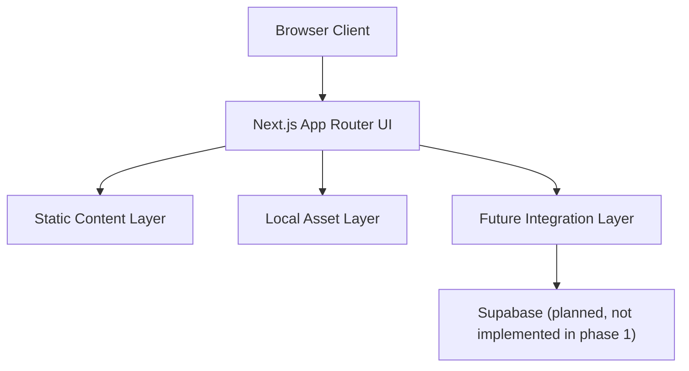
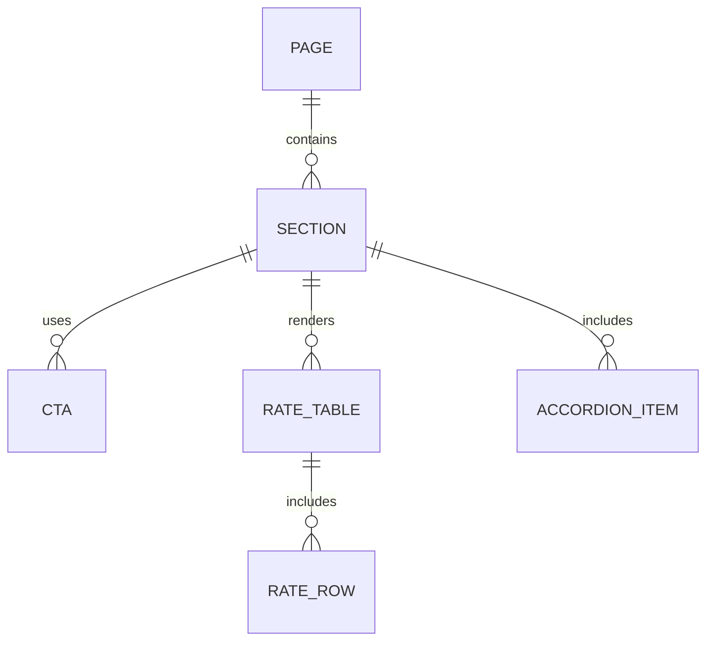

## 1. Architecture Design


## 2. Technology Description
- Frontend: Next.js 15 + React 19 + TypeScript
- Styling: Tailwind CSS 4 with CSS variables for banking theme tokens
- Initialization Tool: `create-next-app`
- Icons: lightweight React icon library or inline SVGs
- State scope: local component state for segmented controls, accordion expansion, mobile nav, and scroll behaviors
- Data approach: static typed content objects in the codebase for phase 1, designed to be replaced later with Supabase-backed content if needed

## 3. Route Definitions
| Route | Purpose |
|-------|---------|
| / | Main term deposits landing page that mirrors the provided screenshots |

## 4. API Definitions
No backend APIs are required in phase 1.

The page will rely on local TypeScript content models:

```ts
type NavItem = {
  label: string;
  href: string;
};

type ProductCard = {
  badge?: string;
  title: string;
  description: string;
  bullets: string[];
  primaryAction: string;
  secondaryAction: string;
};

type RateRow = {
  term: string;
  maturity: string;
  monthly?: string;
  quarterly?: string;
  halfYearly?: string;
  annually?: string;
};

type AccordionItem = {
  title: string;
  content: string[];
};
```

## 5. Server Architecture Diagram
No custom server architecture is required in phase 1 because the implementation is a frontend-first Next.js application.

## 6. Data Model
### 6.1 Data Model Definition


### 6.2 Data Definition Language
No database schema is required in phase 1.

If Supabase is added later, recommended tables are:
- `site_sections` for editable section copy and ordering
- `site_images` for image metadata and placement
- `faqs` for FAQ question/answer management
- `cta_links` for managing application and discovery links

## 7. Implementation Notes
- Use the App Router structure so the project can grow into additional banking pages later without restructuring.
- Keep sections componentized: `Header`, `Hero`, `StickySectionNav`, `ProductsSection`, `DigitalRatesSection`, `ClassicRatesSection`, `AccordionSection`, `FloatingScrollTop`.
- Store screenshot-matched copy and labels in constants to simplify later edits when the user provides final wording.
- Design rate tables with responsive overflow handling so mobile remains usable without losing the visual feel.
- Keep image handling flexible so the user can add more pictures later without reworking layout primitives.
- Add modular sections for `OpenAccountSection`, `DigitalBankingSection`, `FaqSection`, and `Footer` so the remaining banking modules can evolve without affecting the already completed hero, products, and rates sections.
